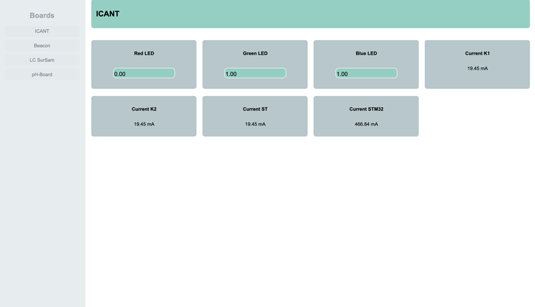
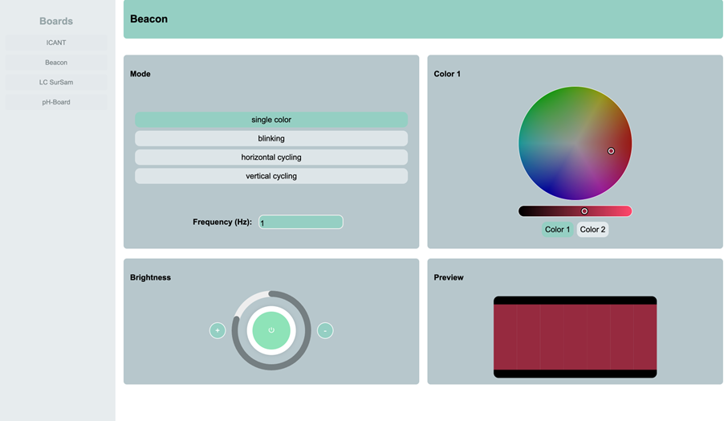
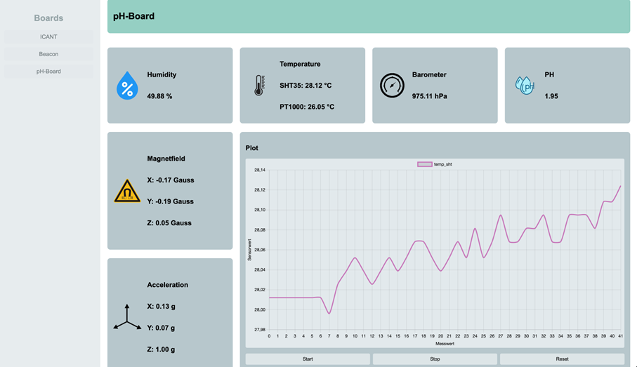
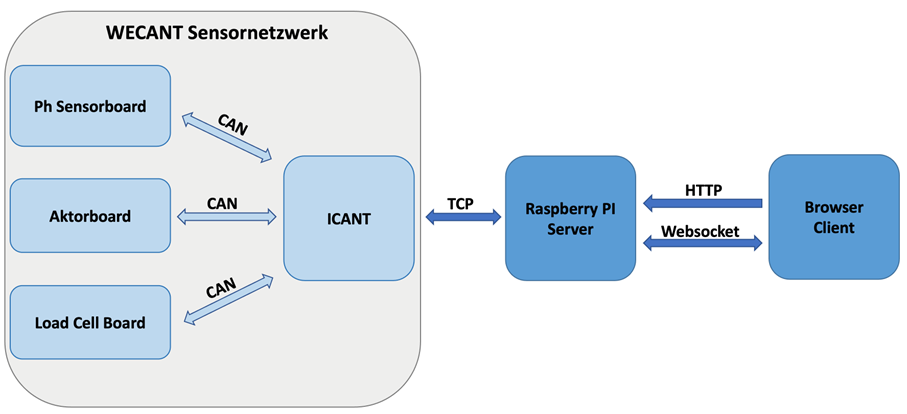
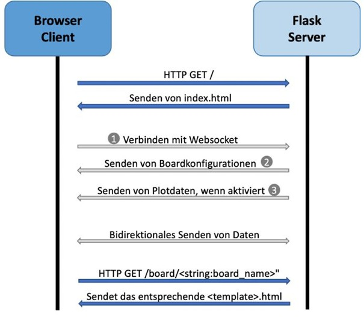

# WECANT_Webinterface
Webinterface for WECANT System of FHNW Rover

## Abstract
Unsere Applikation ist ein Webinterface für das Sensor/Aktor-Netzwerk *WECANT* (Wired Ethernet Can Adaptive Network Topology) des FHNW Rovers. Der Server, programmiert in Python, kommuniziert mti dem *ICANT* (Interface Controller for Adaptive Network Topology) über ein TCP-Stream und beinhaltet ein Webserver mit Flask. Die Client-Server Verbindung besteht aus einem WebSocket, wobei der Client die verschiedenen Boards, verbunden am ICANT, in der Weboberfläche darstellt und bidirektional kommunizieren kann.

## Bedienelemente
Das User Interface besteht aus Navigationstabs, über die die jeweils angeschlossenen Sensor- oder Aktorboards ausgewählt werden können. Beim Wechsel zwischen Boards wird die entsprechende HTML-Vorlage geladen. Die Sensorwerte aktualisieren sich automatisch, sobald neue Daten über die WebSocket-Verbindung gesendet werden.
Die Bedienelemente zur Eingabe oder Steuerung variieren je nach Boardtyp:
- Generisches Layout (siehe Abbildung 1):
Die Interaktion erfolgt über Texteingabefelder, mit denen Variablenwerte verändert werden können.
- Beacon-Board (siehe Abbildung 2):
Die Steuerung erfolgt über einen Colorpicker für die Farbe, über Helligkeitsreglerbuttons sowie Buttons zur Auswahl des Modus. Zusätzlich wird eine Preview des Beacons angezeigt, um anzuzeigen, wie der echte Beacon aussieht. Die Frequenz kann über ein Texteingabefeld verändert werden.
- Boards mit Plot-Funktion (z. B. pH-Sensorboard, siehe Abbildung 3):
Die Visualisierung erfolgt in einem Chart, das per Button-Steuerung kontrolliert wird:
    - Start: Beginnt die Datenaufzeichnung und Darstellung im Plot.
    - Stop: Pausiert die Visualisierung, ohne die bisherigen Daten zu löschen.
    - Reset: Löscht alle bisher gespeicherten Werte, sodass ein leerer Plot entsteht.



**Abb. 1:** Generisches Layout



**Abb. 2:** Beacon



**Abb. 3:** pH-Sensor


## Funktionsweise der Applikation
Die Applikation besteht serverseitig aus einem Flask-Backend. Dieses verarbeitet HTTP-Anfragen und nutzt WebSocket-Verbindungen, um Sensordaten, die vom ICANT per TCP kommen, an den Client zu senden oder Benutzereingaben zu empfangen. Benutzereingaben, die vom Client stammen und für bestimmte Boards bestimmt sind, leitet der Server per TCP an das ICANT-Modul weiter. Das ICANT wiederum überträgt diese Daten über den CAN-Bus an die jeweiligen Boards. Dieser Aufbau ist in Abbildung 4 dargestellt.



**Abb. 4:** Netzwerkaufbau

Die Kommunikation zwischen Server und Browser ist in Abbildung 5 dargestellt.
Beim Aufrufen der Webseite sendet der Server die Datei index.html an den Browser. Gleichzeitig baut der Client eine WebSocket-Verbindung zum Server auf.
Nach erfolgreicher Verbindung übermittelt der Server die Konfiguration aller aktuell angeschlossenen Sensor- oder Aktorboards. Diese Konfigurationsdaten werden im Client verarbeitet und entsprechend visualisiert.
Ist für eine Variable eines Boards die Plot-Funktion aktiviert, sendet der Server ein Array mit bisherigen Sensordaten an den Client. Falls das entsprechende Board gerade angezeigt wird, werden diese Daten im Plot dargestellt.
Nach Abschluss dieser Initialisierungsphase beginnt die eigentliche Laufzeitkommunikation: Server und Client tauschen über die WebSocket-Verbindung bidirektional Daten aus.
Der Wechsel zwischen den Boards erfolgt über Navigationstabs im Client. Beim Umschalten sendet der Browser einen HTTP-Request mit dem gewünschten Boardnamen an den Server. Anhand des Anfangs des Boardnamens entscheidet der Server, welches HTML-Template (z. B. für Beacon-, LC- oder pH-Boards) geladen und zurückgesendet wird.



**Abb. 5:** Kommunikation

## Serverseitige API Endpoints
| Typ       | Endpoint / Event       | Beschreibung |
|-----------|------------------------|--------------|
| **HTTP**  | `/`                    | Liefert die Startseite `index.html`. |
| **HTTP**  | `/board/<board_name>`  | Liefert ein Template abhängig vom Typ des Boards. |
| **WebSocket** | `connect`          | Wird beim Aufbau einer neuen WebSocket-Verbindung ausgelöst. Sendet an den verbundenen Client:<br>• alle bekannten Board-Konfigurationen als `NewBoard`-Events<br>• alle gespeicherten Plot-Daten als `PlotData`-Events. |
| **WebSocket** | `message`          | Verarbeitet eingehende Nachrichten und leitet sie an `wecant.handle_received_data(msg)` weiter. |


## Beschreibung Source Code und Funktionsweise des Clients
### Server
Der Server besteht aus zwei Python-Scripts. Das File [wecantServer.py](server/wecantServer.py) startet den die Verbindung zum ICANT und den Flask-Webserver. Zudem werden die HTTP und WebSocket Endpoints definiert und die nötigen Threads gestartet. Das File [wecantInterface.py](server/PythonModules/wecantInterface.py) beinhaltet alle Logik und Funktionen für die Kommunikation mit dem ICANT. Für genauere Informationen über den Server-Code können die Docstrings der Funktionen angeschaut werden.

### Client
Der Client setzt sich aus mehreren HTML-Vorlagen für die verschiedenen Sensorboards, passenden [CSS-Stylesheets](client/static/css) und [JavaScript-Code](client/static/js) zur Kommunikation und Darstellung der Sensordaten zusammen.
In der Datei [main.js](client/static/js/main.js) wird die Kommunikation mit dem Server organisiert, sowie bereits allgemeine Änderungen im DOM, wie beispielsweise das Einsetzen von einem neuen Sensorwert in einem Textfeld oder der Aufbau des generischen Layouts durchgeführt. Spezifischere Anpassungen im DOM, wie die Visualisierung der Helligkeit beim Beacon werden in den zum HTML-Template gehörigen JavaScript Dateien umgesetzt. Diese enthalten auch die Initialisierung von Event Listenern, welche für die Interaktion mit Board-spezifischen Elementen notwendig sind.

Der Client kann bei zwei Arten von Nachrichten an den Server senden:
- Variablenupdate: Sendet einen neuen Wert für eine bestimmte Variable eines Boards (z. B. über ein Eingabefeld).
- Plotstate-Änderung: Steuert, ob eine bestimmte Variable vom Server fortlaufend in einem Array gespeichert wird. Zusätzlich kann damit ein Reset (Löschen bisheriger Daten) ausgelöst werden.

Der Client reagiert auf mehrere WebSocket-Events vom Server:
- NewBoard: Wird beim Websocket Verbindungsaufbau gesendet oder wenn ein neues Board eingesteckt wird. Die Nachricht enthält den Boardnamen, die BoardID, die Variablennamen mit dem aktuellen Wert, sowie Schreib-/Lese-Berechtigungen und den aktuellen plotState.
- PlotData: Enthält bisherige Werte für eine Variable, die zur initialen Darstellung im Chart verwendet werden.
- NewValue: Überträgt neue Sensordaten, die im Client entweder in Textfeldern oder anderen Anzeigeelementen dargestellt werden. Ist die Plot-Funktion aktiviert, werden die Werte zusätzlich im Plot ergänzt.

## Inbetriebnahme
### Module installieren mit pip
Falls noch nicht vorhanden muss flask und flask-socketio installiert werden. Die folgende Zeile bezieht sich auf Systeme, welche pip verwenden. 
```bash
pip install flask flask-socketio
```
### Module installieren mit apt als Packet Manager
Beim Raspberry Pi 5 ist pip als Packet Manager nicht mehr erwünscht. Dadurch soll beim Raspberry Pi 5 mit einer virtuellen Python Umgebung gearbeitet werden, um keine Paket-Konflikte zu riskieren. Mit folgenden Codezeilen kann die virtuelle Python Umgebung installiert werden. Dabei muss beachtet werden, dass man in den Ordner navigiert, in welchem auch die source und client Ordner liegen.
```bash
sudo apt install python3-venv
python3 -m venv flaskenv
source flaskenv/bin/activate
pip install flask flask-socketio eventlet
```

### Hardware verbinden
Das ICANT muss mit +5V (mindestens 3A Strombegrenzung) gespiesen werden. Es muss eine Ethernet-Verbindung (100MBit) zum Server hergestellt werden. Dabei muss der Server im selben Subnetz wie das ICANT liegen, welches 172.16.10.0/24 ist. Dabei muss beachtet werden, dass das ICANT die IP 172.16.10.82 besitzt und diese somit nicht nochmals vergeben werden darf. Anschliessend können beliebige WECANT-Boards mit den zugehörigen Kabel an das ICANT verbunden werden.

### Server starten
Falls beim Raspberry Pi 5 mit der virtuellen Umgebung gearbeitet wird, dann muss zuerst noch die virtuelle Umgebung aktiviert werden.
```bash
source flaskenv/bin/activate
```
Nun kann das Python Script *wecantServer.py* gestartet werden:
```bash
python wecantServer.py
```


### Mit Website verbinden
Falls lokal auf den Server zugegriffen werden soll, kann die Website durch [diesen Link](http://localhost:5000/) aufgerufen werden. Bei externem Server kann die Website auf dem Port 5000 aufgerufen werden. Dies wird beim Raspberry Pi mit Hostname WecantInterface durch [diesen Link](http://wecantwebinterface.local:5000/) gemacht.
